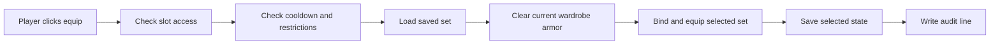

# RuinedWardrobe Wiki

RuinedWardrobe is a Paper and Folia wardrobe plugin for servers that want armor sets to feel polished for players and boringly safe for staff. Players save armor into wardrobe slots, equip sets from a GUI, and the plugin handles storage, anti-dupe behavior, death handling, diagnostics, and migration safety around it.

This wiki is written for server owners first. It focuses on what to install, what to change, what to leave alone, and where to look when a player says something went wrong.

## Start Here

| If you need to... | Open this |
| --- | --- |
| Install it for the first time | [Quick Start](Quick-Start.md) |
| Set up ranks and staff permissions | [Permissions And Commands](Permissions-And-Commands.md) |
| Tune storage, death behavior, restrictions, and performance | [Configuration](Configuration.md) |
| Change the menu, item names, lore, and messages | [GUI And Language Customization](GUI-And-Language-Customization.md) |
| Use PlaceholderAPI, Vault, or combat hooks | [Placeholders And Integrations](Placeholders-And-Integrations.md) |
| Move SQLite data to MySQL or protect backups | [Storage, Migration, And Backups](Storage-Migration-And-Backups.md) |
| Investigate missing armor, dupe reports, or storage errors | [Audit Logs And Troubleshooting](Audit-Logs-And-Troubleshooting.md) |
| Update the jar safely | [Upgrade And Release Checklist](Upgrade-And-Release-Checklist.md) |
| Check what the license allows | [License And Server Monetization](License-And-Server-Monetization.md) |
| Answer common questions fast | [FAQ](FAQ.md) |

## What Players See

- `/wardrobe` or `/rw` opens a page-based armor wardrobe.
- Each wardrobe column stores one armor set.
- Players drag armor into slots, click the set button to equip, and click it again to unequip.
- Locked slots show when a player does not have enough slot permission.
- Equipped wardrobe armor is protected while worn.

## What Staff Get

| Feature | Why it matters |
| --- | --- |
| SQLite by default | Works for a single server without extra setup. |
| MySQL/MariaDB support | Lets networks share wardrobe data across servers. |
| Bound armor protection | Blocks common move, drop, swap, dispense, and container abuse paths. |
| Configurable death behavior | Choose vanilla-style item loss or protected wardrobe sets. |
| Audit logs | Trace save, equip, edit, death, sanitizer, sync, and storage events. |
| `/wardrobe doctor` | Check storage, cache, queue, sync, and DB probe status in game. |
| Snapshot migration | Dry-run and real migrations verify copied data before reporting success. |
| Config version guards | Old config files are backed up and replaced when templates change. |

## How Equip Works



## Default Files

After the first startup, expect this layout:

```text
plugins/RuinedWardrobe/
  config.yml
  gui.yml
  permissions.yml
  data/wardrobe.db
  lang/en_US.yml
  logs/wardrobe-audit-YYYY-MM-DD.log
```

## Best Defaults

| Server type | Recommended setup |
| --- | --- |
| Small single server | Keep `storage.type: SQLITE`, leave audit enabled, use rank slot permissions. |
| Large single server | Keep SQLite only if storage is local and fast; lower join-time DB work. |
| Network | Use `storage.type: MYSQL`, keep sync polling on, and test migration with `--dry-run`. |
| High-risk economy server | Consider `anti-dupe.strict-container-lock: true` after testing player flow. |
| Heavy support workload | Keep `audit.include-item-summaries: true` and use `/wardrobe doctor` during reports. |

## The Three Rules

1. Back up `plugins/RuinedWardrobe` before updates or migrations.
2. Run `/wardrobe migrate mysql --dry-run` before a real migration.
3. Use the audit log first when investigating item issues.
