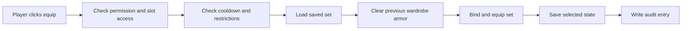
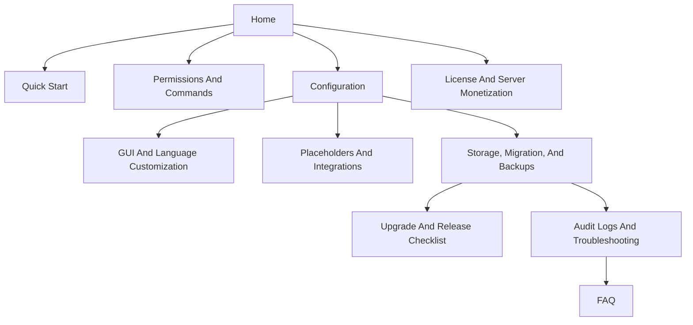

# RuinedWardrobe

[](https://github.com/Riqqqque/RuinedWardrobe/releases/latest)
[](https://github.com/Riqqqque/RuinedWardrobe/releases/download/v1.0.0/RuinedWardrobe-1.0.0.jar)
[](https://papermc.io/)
[](https://adoptium.net/)
[](https://github.com/Riqqqque/RuinedWardrobe/blob/main/LICENSE)

RuinedWardrobe is a Paper and Folia wardrobe plugin for servers that want armor cosmetics to feel clean for players and dependable for staff. Players save armor sets into GUI slots, equip or unequip them with one click, and the plugin handles persistence, bound armor protection, diagnostics, audit logs, and storage migration around it.

This wiki is written for server owners, admins, and support staff. It favors operational decisions over code trivia: what to install, what to configure, what to test, and where to look when something goes wrong.

> [!TIP]
> New install? Start with [Quick Start](Quick-Start.md), then set up [Permissions And Commands](Permissions-And-Commands.md), then review [Configuration](Configuration.md).

## At A Glance

| Area | Details |
| --- | --- |
| Server platform | Paper or Folia |
| Java | `25` |
| Target API | Paper `26.1.1` |
| Default storage | SQLite at `plugins/RuinedWardrobe/data/wardrobe.db` |
| Network storage | MySQL or MariaDB |
| Main commands | `/wardrobe`, `/rw` |
| First permission | `ruinedwardrobe.use` |
| Default unlocked slots | `3` |
| Author | Rique |

## Choose Your Path

| Goal | Best page |
| --- | --- |
| Install the jar and run the first test | [Quick Start](Quick-Start.md) |
| Build ranks, slot tiers, and staff access | [Permissions And Commands](Permissions-And-Commands.md) |
| Tune storage, death behavior, restrictions, and performance | [Configuration](Configuration.md) |
| Redesign the inventory GUI or language text | [GUI And Language Customization](GUI-And-Language-Customization.md) |
| Connect PlaceholderAPI, Vault, or combat checks | [Placeholders And Integrations](Placeholders-And-Integrations.md) |
| Move SQLite data to MySQL or restore backups | [Storage, Migration, And Backups](Storage-Migration-And-Backups.md) |
| Investigate missing armor, dupe reports, or DB errors | [Audit Logs And Troubleshooting](Audit-Logs-And-Troubleshooting.md) |
| Update safely on a live server | [Upgrade And Release Checklist](Upgrade-And-Release-Checklist.md) |
| Check license and monetization rules | [License And Server Monetization](License-And-Server-Monetization.md) |
| Get quick answers | [FAQ](FAQ.md) |

## Player Experience

| Player action | What happens |
| --- | --- |
| Open `/wardrobe` or `/rw` | A page-based armor wardrobe opens. |
| Drag armor into a column | That column becomes a saved set. |
| Click a set button | The saved armor equips and becomes bound to the player while worn. |
| Click the active set button | The wardrobe armor unequips cleanly. |
| Open locked slots | Locked slots show when the player lacks the required slot tier. |

## Staff Toolkit

| Tool | Why it matters |
| --- | --- |
| `/wardrobe doctor` | Checks storage, cache, DB queue, sync, and a real DB probe from in game. |
| Audit logs | Trace save, equip, rename, delete, death, sanitizer, sync, and error events. |
| Bound armor protection | Blocks common move, drop, swap, dispense, and container abuse paths. |
| Config version guards | Old configs are backed up and regenerated when bundled templates change. |
| Snapshot migration | Dry-runs, backups, target overwrite protection, and digest verification. |
| Staff admin commands | Open player wardrobes and adjust bonus slots without changing rank nodes. |

## Equip Flow



## Default Files

After first startup, the plugin folder should look like this:

```text
plugins/RuinedWardrobe/
  config.yml
  gui.yml
  permissions.yml
  data/wardrobe.db
  lang/en_US.yml
  logs/wardrobe-audit-YYYY-MM-DD.log
```

## Recommended Defaults

| Server type | Setup |
| --- | --- |
| Small single server | Keep `storage.type: SQLITE`, leave audit enabled, use rank slot permissions. |
| Large single server | Keep SQLite only on fast local storage, and keep join-time DB work off unless needed. |
| Multi-server network | Use `storage.type: MYSQL`, keep sync polling enabled, and test migration with `--dry-run`. |
| Economy-focused server | Test `anti-dupe.strict-container-lock: true` before using it live. |
| Heavy support workload | Keep `audit.include-item-summaries: true` and use `/wardrobe doctor` during reports. |

## Production Rules

1. Back up `plugins/RuinedWardrobe` before updates, migrations, or layout changes.
2. Run `/wardrobe migrate <target> --dry-run` before every real migration.
3. Keep audit logs enabled unless you have a measured reason to turn them off.
4. Test with a normal player account, not only an operator account.
5. Use the wiki checklists before opening a new build to players.

## Important Links

- [Repository](https://github.com/Riqqqque/RuinedWardrobe)
- [Latest Release](https://github.com/Riqqqque/RuinedWardrobe/releases/latest)
- [License](https://github.com/Riqqqque/RuinedWardrobe/blob/main/LICENSE)

## Page Map


