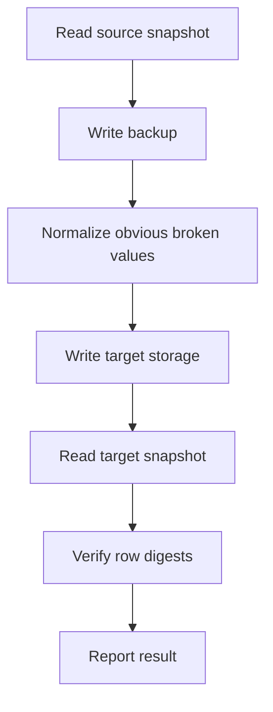

# Storage, Migration, And Backups

Storage is one of the few areas where a boring setup is the best setup. Pick the backend that matches your server, back it up, and test migrations before moving real data.

## Choosing Storage

| Use case | Backend |
| --- | --- |
| One server | SQLite |
| Test server | SQLite |
| Network with shared wardrobe data | MySQL/MariaDB |
| External DB backups or monitoring | MySQL/MariaDB |

## SQLite

Default path:

```text
plugins/RuinedWardrobe/data/wardrobe.db
```

Use SQLite when one server owns the data. Keep it on fast local storage and include the whole `plugins/RuinedWardrobe` folder in backups.

## MySQL/MariaDB

Use MySQL or MariaDB when multiple servers need the same wardrobe data.

Minimum checklist:

- Use a dedicated database.
- Use a dedicated DB user.
- Keep credentials out of screenshots and public logs.
- Make sure the DB server allows connections from the Minecraft server.
- Keep Hikari pool size and DB worker threads aligned.
- Monitor connection limits if several plugins share the same DB host.

## Migration Command

```text
/wardrobe migrate <sqlite|mysql> [--dry-run]
```

Dry-run first:

```text
/wardrobe migrate mysql --dry-run
```

Then run the real migration:

```text
/wardrobe migrate mysql
```

## What Migration Does



If verification fails, do not keep retrying blindly. Check console, audit logs, DB credentials, and available disk space.

## Legacy Import

RuinedWardrobe can import older local schema layouts during startup. It backs up old tables before removing them.

## Backup Checklist

Before a major update or storage move:

1. Stop the server.
2. Back up `plugins/RuinedWardrobe`.
3. Back up the external MySQL/MariaDB database if used.
4. Keep a copy of the old jar.
5. Start the server with the new jar.
6. Run `/wardrobe doctor`.
7. Test save, equip, switch, delete, death, and reload.
8. Keep backups until real players have tested normal use.

## Restore Checklist

1. Stop the server.
2. Move the broken `plugins/RuinedWardrobe` folder somewhere safe.
3. Restore the known-good backup.
4. Restore the matching MySQL/MariaDB backup if the server uses external storage.
5. Start the server.
6. Run `/wardrobe doctor`.
7. Test one player profile before opening to everyone.

## Storage Troubleshooting

| Symptom | Likely area |
| --- | --- |
| `/wardrobe doctor` says DB probe failed | Credentials, host, port, network, driver, or DB availability. |
| Migration says source and target are the same | Change `storage.type` or target direction before rerunning. |
| Queue depth keeps rising | DB is slow, offline, or worker/pool sizing is too low for the load. |
| SQLite errors after host crash | Restore from backup, then check disk health and available space. |
| MySQL sync seems delayed | Check `performance.sync.poll-seconds` and `batch-size`. |
