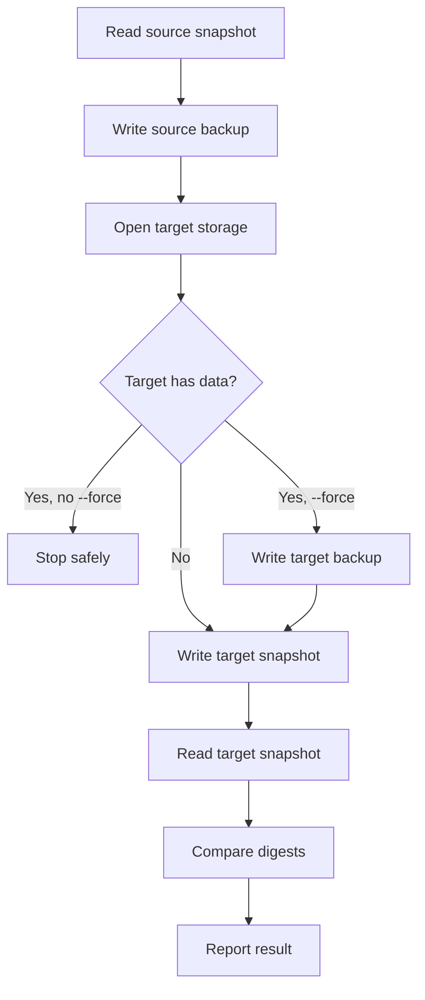

# Storage, Migration, And Backups

Storage is the area where boring is best. Pick the backend that matches your server shape, back it up, and dry-run migrations before copying real player data.

> [!CAUTION]
> Never run a real migration as your first test. Use `--dry-run`, read the result, then migrate.

## Storage Decision

| Use case | Backend | Notes |
| --- | --- | --- |
| One production server | SQLite | Easiest setup. Keep it on fast local storage. |
| Test server | SQLite | Simple and disposable. |
| Multi-server network | MySQL/MariaDB | Required when several servers need shared wardrobe data. |
| External DB backups or monitoring | MySQL/MariaDB | Better fit for managed database workflows. |

## SQLite

Default path:

```text
plugins/RuinedWardrobe/data/wardrobe.db
```

Use SQLite when one server owns the data. Include the full `plugins/RuinedWardrobe` folder in backups so config, GUI, language, logs, and storage stay together.

## MySQL And MariaDB

Use MySQL or MariaDB when multiple servers need the same wardrobe data.

Minimum checklist:

- Create a dedicated database.
- Create a dedicated DB user.
- Keep credentials out of screenshots and public logs.
- Confirm the DB server accepts connections from the Minecraft server.
- Keep Hikari pool size and DB worker threads close to each other.
- Watch global connection limits if several plugins share the same DB host.

## Migration Command

```text
/wardrobe migrate <sqlite|mysql> [--dry-run] [--force]
```

Dry-run first:

```text
/wardrobe migrate mysql --dry-run
```

Then run the real migration:

```text
/wardrobe migrate mysql
```

If the target storage already contains wardrobe data, RuinedWardrobe stops before overwriting it. After you confirm the target can be replaced, rerun the same command with `--force`. A backup of the target data is written before overwrite.

## Migration Guarantees

| Step | Guarantee |
| --- | --- |
| Source read | Reads a full snapshot of players, sets, and meta rows. |
| Source backup | Writes a full backup before copying data. |
| Target safety check | Refuses to overwrite non-empty target storage unless `--force` is present. |
| Target backup | Writes a target backup before forced overwrite. |
| Normalization | Fixes obviously broken snapshot values before write. |
| Verification | Reads the copied target and compares digest output before reporting success. |



If verification fails, stop and inspect console, audit logs, DB credentials, available disk space, and target DB health before retrying.

## Legacy Import

RuinedWardrobe can import older local schema layouts during startup. It backs up old tables before removing them, then writes the current schema.

## Backup Checklist

Before a major update or storage move:

1. Stop the server.
2. Back up `plugins/RuinedWardrobe`.
3. Back up the external MySQL/MariaDB database if used.
4. Keep a copy of the old jar.
5. Start the server with the new jar.
6. Run `/wardrobe doctor`.
7. Test save, equip, switch, delete, death, reload, and restart.
8. Keep backups until real players have tested normal use.

## Restore Checklist

1. Stop the server.
2. Move the broken `plugins/RuinedWardrobe` folder somewhere safe.
3. Restore the known-good plugin folder backup.
4. Restore the matching MySQL/MariaDB backup if external storage is used.
5. Start the server.
6. Run `/wardrobe doctor`.
7. Test one player profile before opening to everyone.

## Storage Troubleshooting

| Symptom | Likely area |
| --- | --- |
| `/wardrobe doctor` says DB probe failed | Credentials, host, port, network, driver, or DB availability. |
| Migration says source and target are the same | Change `storage.type` or the target direction before rerunning. |
| Migration stops because target has data | Confirm replacement is intended, then rerun with `--force`. |
| Queue depth keeps rising | DB is slow, offline, or worker/pool sizing is too low for load. |
| SQLite errors after host crash | Restore from backup, then check disk health and available space. |
| MySQL sync seems delayed | Check `performance.sync.poll-seconds` and `batch-size`. |

## Related Pages

- [Configuration](Configuration.md)
- [Upgrade And Release Checklist](Upgrade-And-Release-Checklist.md)
- [Audit Logs And Troubleshooting](Audit-Logs-And-Troubleshooting.md)
